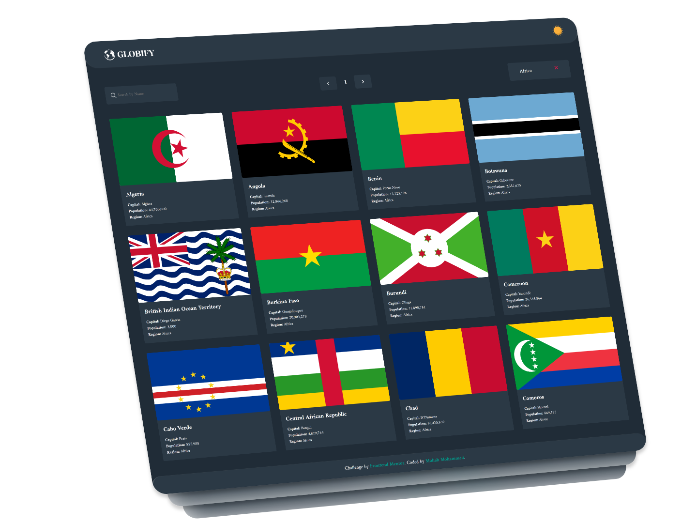
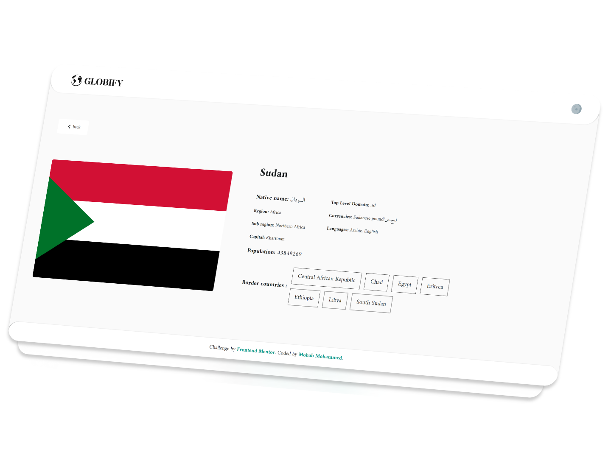
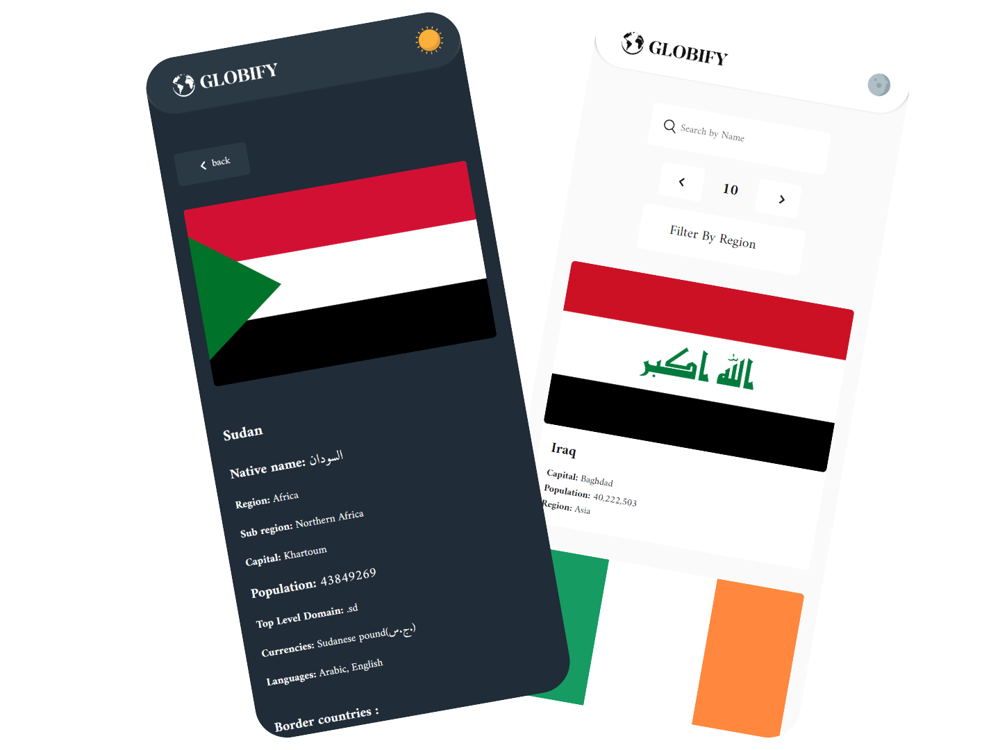

# our-world

This is a solution to the [REST Countries API with color theme switcher challenge on Frontend Mentor](https://www.frontendmentor.io/challenges/rest-countries-api-with-color-theme-switcher-5cacc469fec04111f7b848ca).

## Table of contents

- [Overview](#overview)
  - [Promo](#promo)
  - [The challenge](#the-challenge)
  - [Screenshot](#screenshot)
  - [Links](#links)
- [My process](#my-process)
  - [Built with](#built-with)
  - [Continued development](#continued-development)
- [Author](#author)

## Overview

## Promo

<video style="max-width:500px;aspect-ratio:16 / 9" src="./public/Promo.mp4"></video>

### The challenge

Users should be able to:

- See all countries from the API on the homepage.
- Search for a country using an `input` field.
- Filter countries by region.
- Click on a country to see more detailed information on a separate page.
- Click through to the border countries on the detail page.
- Toggle the color scheme between light and dark mode.

### Screenshot

 

### Links

- [Solution URL](https://github.com/mohap710/globify)
- [Live Site URL](https://mohap710.github.io/globify/)

## My process

### Built with

- Semantic HTML5 markup
- CSS custom properties
- Flexbox
- CSS Grid
- Mobile-first workflow
- [VueJs](https://vuejs.org/) - JS library
- [Pinia](https://pinia.vuejs.org/) - Pinia is a store library for Vue, it allows you to share a state across components/pages.
- [Styled Components](https://styled-components.com/) - For styles

### Continued development

- Add preloader.
- Improve filter combination (search within selected region).
- Improve Pagination when using filtering or searching.
- Use map Instead of showing countries cards.

## Author

- Website - [Mohab Mohammed](https://www.mohap710.github.io/My-Portfolio)
- Frontend Mentor - [@mohap710](https://www.frontendmentor.io/profile/mohap710)
- Twitter - [@mohab_m_salman](https://www.twitter.com/mohab_m_salman)
